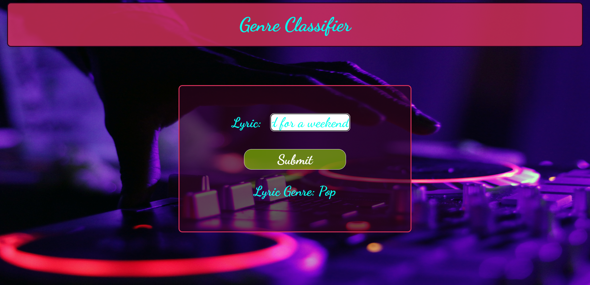

# Genre Classification and popularity prediction.

A Web Application for Music Analysis

This project is a web application that uses machine learning models to classify the genre and predict the popularity of a given song lyrics. It uses logistic regression for genre classification and linear regression for popularity prediction. 

Here's a live deployment - https://genre-classification.onrender.com/

<center>
    
</center>

## Tech-Stack

- Python
- Flask
- HTML
- CSS

## Features

- The application allows the user to upload song lyrics..
- The application uses the trained logistic regression model to classify the track into one of the 3 genres: metal, pop, or rock.

## Installation and Usage

To install and run this project, you need to have Python 3 installed on your computer. You also need to install and import the following Python libraries:

- flask
- sklearn
- render_template
- request
- numpy
- pandas
- json
- os

You can use any IDE or editor of your choice.

To download the code files for this project, you can clone this GitHub repository using the following command:

```git clone https://github.com/myusername/Genre-Classification.git```

To execute the code, you can run the following command:

```py app.py ```
or
```python app.py```

To access the web application from your web browser, you can enter the URL of your local host followed by the port number (such as http://127.0.0.1:5000/).

## References

This project was inspired by and based on the following sources:

[Pop, Rap or Heavy Metal - Lyrics Classifier](https://www.kaggle.com/code/ivankhrulenko/pop-rap-or-heavy-metal-lyrics-classifier/notebook) from kaggle 

